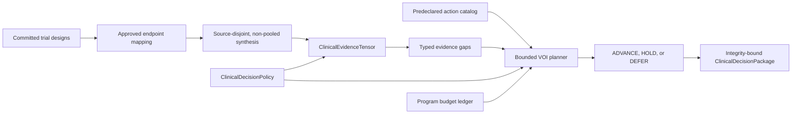

# Clinical Evidence Tensor and Bounded VOI Planning

## Scope

This layer turns one committed, replay-valid `BenefitRiskSynthesisRecord` into a
machine-readable clinical evidence tensor and a budget-bounded evidence-acquisition plan.
It does not pool trials, estimate population comparability, compute a clinical benefit-risk
score, recommend treatment, or infer regulatory or clinical acceptability.

The plan's `ADVANCE` label has a deliberately narrow meaning: all preregistered
**evidence-workflow** criteria are satisfied for the current tensor. `HOLD` means that open
gaps have one or more selected evidence actions. `DEFER` means that gaps remain but no
qualified action can be scheduled under the declared catalog, VOI threshold, and budget.
The layer never emits `KILL` or `PIVOT`.

## Data Flow



`compile_clinical_evidence_tensor` first validates the complete committed program history,
requires an exact synthesis-ledger match, and runs synthesis continuity recompilation.
An uncommitted, replaced, or non-replayable synthesis cannot enter the tensor.

## Tensor Contract

Each `ClinicalEvidenceCell` retains one selected trial's:

- trial, design, endpoint, safety, and synthesis study identities;
- hazard ratio, confidence interval, and log-scale interval width;
- candidate and comparator endpoint measurements, including source-reported missing values, unit,
  and time frame;
- serious-event affected/at-risk counts, observed risks, and unadjusted risk difference;
- benefit and observed safety direction labels;
- exact source evidence IDs and source-content SHA-256 values;
- endpoint and safety record fingerprints.

The tensor evaluates ten ordered dimensions:

| Dimension | Workflow criterion |
| --- | --- |
| Source independence | Selected trial source hashes remain disjoint. |
| Trial count | Meets the preregistered minimum independent-trial count. |
| Benefit direction | Every trial's interval is entirely in the declared favorable direction. |
| Benefit precision | Every log-scale interval width is at or below the policy threshold. |
| Descriptive arm measurement completeness | Every selected candidate and comparator arm has a source-reported numeric summary. |
| Safety direction | No trial has higher observed aggregate serious-event risk and directions agree. |
| Safety exposure | Each candidate and comparator arm meets the minimum participant count. |
| Endpoint time frame | Exact strings are identical across selected trials. |
| Safety time frame | Exact strings are identical across selected trials. |
| Measurement unit | Exact strings are identical across selected trials. |

These are workflow criteria, not validated clinical decision thresholds. Exact-string alignment
does not establish scientific comparability, and equal or lower observed aggregate serious-event
risk does not establish safety.

## Gap Ontology

Every failed dimension produces one typed `ClinicalEvidenceGap` with a canonical code, summary,
gap mass, implicated study IDs, and source evidence IDs. Benefit-harm and higher-observed-serious-
event-risk gaps are marked as `blocking_signal`; all gaps block workflow advance.

Gap mass is a bounded deterministic priority input:

- count and exposure gaps use normalized shortfall;
- missing descriptive arm summaries use the fraction of selected arm summaries that are missing;
- interval-width gaps use normalized threshold exceedance;
- direction conflicts, unfavorable signals, and exact-string mismatches use `1.0`.

It is not a posterior probability, effect size, evidence-quality score, or calibrated uncertainty.

## Bounded VOI

Each `ClinicalEvidenceActionOption` declares:

- exact action/tool/operation identity and JSON arguments;
- the gap codes it can address;
- expected gap-resolution probability;
- decision relevance;
- maximum cost.

Only retrieval, database-query, and verifier actions are allowed. Candidate editing and autonomous
terminal actions are outside this contract.

For the not-yet-targeted gaps of an option:

```text
marginal_gap_mass = 1 - product(1 - gap_mass)
bounded_voi = marginal_gap_mass
              * expected_gap_resolution_probability
              * decision_relevance
voi_per_cost = bounded_voi / max_cost
```

The planner repeatedly selects the affordable option with highest `voi_per_cost`, then highest
`bounded_voi`, then lowest cost, then lexicographically smallest action ID. A selected action
claims a gap only for marginal ranking; the gap remains open until new source evidence is ingested
and the synthesis/tensor is recompiled.

The complete required action batch is bounded by:

- the current `BudgetState.remaining`;
- `ClinicalDecisionPolicy.max_planned_cost`;
- `ClinicalDecisionPolicy.max_planned_actions`;
- `ClinicalDecisionPolicy.minimum_bounded_voi`.

No partial action is exposed when every qualified action is unaffordable.

## Provenance and Replay

`ClinicalDecisionPackage` contains the exact policy, canonical action catalog, tensor, plan, and
non-removable interpretation limitations. SHA-256 fingerprints bind:

- synthesis to tensor;
- policy to tensor and plan;
- tensor to plan;
- action options to selected actions;
- the complete package to its public envelope.

Package construction deterministically replays action ranking, scores, gap partition, and budget
accounting. `validate_clinical_decision_package` then recompiles the tensor and plan from the
current committed state. Strict JSON readers reject unknown or missing fields, duplicate keys,
non-finite values, unsupported schema versions, and integrity mismatches.

Public machine contracts:

- `rl_env/specs/clinical_evidence_decision_package.schema.json`
- `rl_env/specs/clinical_evidence_decision_package.example.json`

The adjacent example is fully synthetic and compiler-generated from two source-disjoint test
bundles. It is a contract example, not a clinical result or calibrated action policy.

## Minimal API

```python
from agentic_drug_discovery import compile_clinical_decision_package

package = compile_clinical_decision_package(
    state,
    committed_synthesis,
    policy,
    action_catalog,
    package_id="program:clinical-decision:v1",
    tensor_id="program:clinical-evidence:v1",
    plan_id="program:clinical-evidence-plan:v1",
)
```

The caller must supply a preregistered policy and action catalog. The compiler does not invent
clinical thresholds, resolution probabilities, relevance values, tools, or costs.

## Current Limitations

- Hazard-ratio benefit endpoints and posted aggregate serious-event counts inherit the v1
  synthesis limitations.
- Interval-width and participant-count thresholds are policy inputs, not empirically calibrated
  clinical standards.
- Expected gap-resolution probabilities and decision relevance require external calibration.
- Action selection is deterministic marginal greedy prioritization, not a causal, Bayesian, or
  health-economic VOI analysis.
- Selected actions are planning records; provider execution and post-action synthesis refresh are
  not yet connected into an automatic closed loop.
- Population transportability, risk of bias, multiplicity, follow-up adjustment, censoring,
  exposure time, competing risks, and event-level causality are not inferred.
