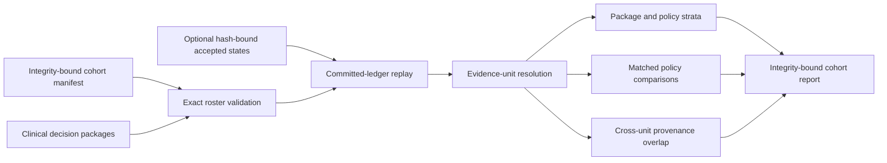

# Clinical Cohort Diagnostics and Matched Policy Sensitivity

## Scope

This layer compares multiple integrity-bound `ClinicalDecisionPackage` artifacts without adding
outcome labels or pooling clinical results. It answers operational questions that a single package
cannot answer:

1. How often does each workflow decision, evidence gap, dimension status, and selected action occur?
2. Which results come from distinct evidence units and which are alternate policies over the same
   committed synthesis?
3. When two policies see the same evidence unit, where do their decisions, gap profiles, action
   plans, and planned costs differ?
4. Are source-content hashes or trial identifiers reused across nominally distinct evidence units?

These are workflow-behavior diagnostics. They do not estimate clinical correctness, utility,
safety, policy superiority, or calibration.

## Identity Model

An evidence unit is the SHA-256 identity of:

```text
{
  "program_id": <canonical program id>,
  "synthesis_fingerprint": <exact committed synthesis fingerprint>
}
```

This distinction prevents two policies applied to one synthesis from being counted as two
independent evidence units. A package is unique by `package_id`; a policy is unique by its complete
fingerprint. Reusing one `policy_id + version` with different policy fingerprints fails closed, as
does supplying the same policy twice for one evidence unit.

`ClinicalCohortManifest` binds the exact package roster through package IDs, program IDs, and
package integrity hashes. It can additionally bind a canonical `ProgramState` SHA-256 for every
package. State binding is all-or-none. When present, cohort compilation requires exactly one state
per program and replays every package against its committed mapping, synthesis, and accepted packet
history before aggregation.



## Report Contents

The report preserves one compact diagnostic per package:

- exact package, program, policy, synthesis, endpoint mapping, disease, candidate, intervention,
  endpoint-family, and stage identities;
- package and optional accepted-state SHA-256 values;
- exact trial IDs and source-content hashes;
- all ten dimension statuses and all open, targeted, and untargeted gap codes;
- workflow decision and plan code;
- ranked selected-action fingerprints, tool operations, purposes, costs, and total planned cost.

Aggregate rates always retain `count`, `total`, and `rate`. The compiler emits complete canonical
decision, dimension, and gap rows, including zero-count rows. Action rows use the complete action
fingerprint rather than trusting a reusable action ID.

Policy strata independently report decision distributions, dimension statuses, gap prevalence,
gap targeting, selected actions, and total planned cost. Package-level totals can contain multiple
policies over one evidence unit, so they must not be interpreted as independent clinical samples.

## Matched Policy Sensitivity

Pairwise comparisons are emitted only for policy pairs that share at least one exact evidence
unit. For each pair, the report includes:

- the exact shared evidence-unit IDs;
- the complete 3 by 3 `ADVANCE`/`HOLD`/`DEFER` transition counts;
- changed-decision, changed-gap-profile, and changed-action-plan counts and rates;
- for every gap code, `both`, `policy_a_only`, `policy_b_only`, and `neither` counts;
- total planned cost under each policy on the matched units.

This is controlled sensitivity analysis, not outcome calibration. A stricter or looser policy can
change behavior on the same evidence without becoming more correct. Genuine policy evaluation
still requires independent outcome labels through the sealed and held-out evaluation contracts in
`docs/25_cutoff_safe_policy_evaluation.md` and
`docs/26_independent_heldout_evaluation.md`.

## Provenance Overlap

Source hashes and trial IDs shared only by alternate policy packages for the same evidence unit are
not reported as cross-unit overlap. A value is reported when it appears in at least two distinct
evidence units. Every overlap row carries the exact evidence-unit, program, and package IDs.

The booleans `evidence_units_source_disjoint` and `evidence_units_trial_disjoint` summarize those
exact checks only. Even when both are true, population independence, endpoint comparability,
transportability, risk of bias, and causal independence remain unproven.

## CLI

Compile integrity-only diagnostics from a manifest and its exact package set:

```bash
adds-clinical-evidence cohort \
  --manifest cohort-manifest.json \
  --package policy-a-package.json \
  --package policy-b-package.json \
  --output cohort-report.json
```

The shipped synthetic example is directly reproducible:

```bash
adds-clinical-evidence cohort \
  --manifest rl_env/specs/clinical_evidence_cohort_manifest.example.json \
  --package rl_env/specs/clinical_evidence_decision_package.example.json \
  --package rl_env/specs/clinical_evidence_decision_package.relaxed.example.json \
  --output synthetic-cohort-report.json
```

For accepted-ledger replay, put the canonical state SHA-256 in every manifest binding and supply
one state per program:

```bash
adds-clinical-evidence cohort \
  --manifest state-bound-cohort-manifest.json \
  --package policy-a-package.json \
  --package policy-b-package.json \
  --state accepted-program-state.json \
  --output cohort-report.json

adds-clinical-evidence validate-cohort \
  --report cohort-report.json \
  --manifest state-bound-cohort-manifest.json \
  --package policy-a-package.json \
  --package policy-b-package.json \
  --state accepted-program-state.json

adds-clinical-evidence summarize-cohort --report cohort-report.json
```

Every repeated input roster must match exactly. Duplicate keys, non-finite values, missing or extra
packages/states, hash drift, policy rebinding, duplicate unit-policy pairs, aggregate tampering, and
accidental output replacement fail closed.

## Machine Contracts

- `rl_env/specs/clinical_evidence_cohort_manifest.schema.json`
- `rl_env/specs/clinical_evidence_cohort_manifest.example.json`
- `rl_env/specs/clinical_evidence_cohort_report.schema.json`
- `rl_env/specs/clinical_evidence_cohort_report.example.json`
- `rl_env/specs/clinical_evidence_cohort_summary.schema.json`
- `rl_env/specs/clinical_evidence_decision_package.relaxed.example.json`

The examples are compiler-generated from one synthetic two-trial synthesis under a `HOLD` policy
and a relaxed `ADVANCE` policy. They demonstrate contract behavior only. No real cohort, outcome,
clinical efficacy, safety, treatment, or policy-performance result is included.

## Research Handoff

The report deliberately sets:

```text
outcome_labels_included = false
performance_metrics_included = false
outcome_calibration_status = not_estimable_without_independent_outcomes
```

The next research step is to preregister an independent clinical-program board, map each package's
workflow prediction into a sealed submission before outcomes are exposed, and evaluate exact and
selective risk with the existing held-out protocol. Cohort diagnostics then become an auditable
explanatory layer for observed policy behavior rather than a substitute for evaluation.
