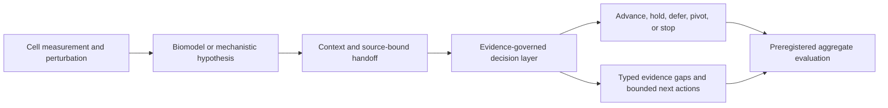

# Biohub-Context Translational Evidence Bridge

**Assessment date:** 2026-08-20
**Status:** Presentation candidate; ready for joint scoping, not execution
**Affiliation:** None claimed. This is an independent public-source alignment review.

## Position in one sentence

The Agentic Drug Discovery System is best presented as a **provenance-preserving
translational decision layer** that turns upstream biological hypotheses into inspectable
evidence packets, explicit gaps, and bounded next actions. It is not a virtual-cell model,
therapeutic design engine, clinical decision maker, or Biohub-endorsed project.

## Why this framing fits

The public [CZ Biohub Network overview](https://www.czbiohub.org/) describes long-horizon
work on dynamic cell systems, inflammation measurement, and immune-cell engineering. The
public [GREmLN description](https://www.czbiohub.org/news/czi-ai-model-scientists-pinpoint-cancer/)
places AI biomodels and a virtual-cell platform upstream of disease-mechanism and target
discovery. The public [Biohub New York investigator FAQ](https://www.czbiohub.org/ny/wp-content/uploads/sites/20/2024/11/chan-zuckerberg-biohub-new-york-investigator-rfp-frequently-asked-questions.pdf)
lists Advanced Single Cell Technologies, In Vivo/In Vitro Modeling, Immune Cell
Engineering, and Network Causality, AI, and ML as core platforms. Biohub and CZI also
emphasize [open scientific software](https://www.czbiohub.org/life-science/open-source-software-science-impact/).

This project does not duplicate those capabilities. Its useful position is immediately
downstream:



The proposed Biohub-context work begins at the handoff in box C. Boxes A and B remain
owned by the relevant experimental and computational scientists.

## Review verdict

| Question | Verdict | Evidence or gap |
|---|---|---|
| Is there an executable system? | Yes, within a bounded public scope | Typed execution, promotion, replay, verifier, clinical synthesis, and evaluation code |
| Is it end to end? | Yes for one retrospective SCD slice | One disease only; seven proposed atlases lack equivalent public slices |
| Does it preserve endpoint and safety provenance? | Yes | Reviewer-approved mappings and source-disjoint, non-pooled synthesis |
| Is uncertainty treated as part of the decision object? | Yes, synthetically | Preregistered outcome, dependence, missingness, estimand, influence, and sampling studies |
| Is it a virtual-cell or perturbation model? | No | Upstream model outputs are a planned input, not a current implementation |
| Is it validated on Biohub data? | No | No Biohub data, model, platform, authorization, or endorsement is integrated |
| Is it ready to present? | Yes, with explicit boundaries | Ten-slide claim ledger and machine-validated evidence anchors are included |
| Is it ready to deploy? | No | A joint use case, upstream handoff contract, real cohort, and governance approval are required |

## What is concrete today

### 1. Evidence-governed execution

The public core records immutable scientific identities, tool contracts, state-bound
requests, tool outcomes, source references, promoted evidence, verifier results, costs,
accepted decisions, and replay inputs. Unsupported or stale transitions fail closed.

**What this proves:** contract execution and provenance continuity.
**What it does not prove:** biological correctness or therapeutic value.

### 2. One audited disease trajectory

The [SCD vertical slice](12_scd_vertical_slice.md) demonstrates a continuous retrospective
path across the eight-stage control plane with exact identity and evidence continuity.

**What this proves:** one coherent path can be represented and replayed.
**What it does not prove:** breadth across diseases, modalities, or Biohub programs.

### 3. Endpoint and safety harmonization

The [clinical synthesis layer](22_clinical_benefit_risk_synthesis.md) retains exact
trial-level endpoint and serious-event values, reviewer-approved mappings, evidence IDs,
and source hashes. It requires source-disjoint trials and prohibits automatic pooling,
endpoint inference, clinical acceptability inference, and treatment recommendations.

### 4. Evidence gaps and bounded next actions

The [clinical evidence tensor and bounded VOI layer](27_clinical_evidence_tensor_and_voi.md)
turns missing or inadequate workflow dimensions into typed gaps and budget-constrained
evidence-acquisition actions. `ADVANCE` means evidence-workflow readiness only.

### 5. Known-truth uncertainty studies

The project separates outcome definition, dependence, evaluability, missingness,
identification, cluster influence, estimand choice, and sampling-frame uncertainty. The
latest [cluster-superpopulation study](38_cluster_superpopulation_sampling.md) recovered
standard-error calibration in all 320 prior failure cells, while still retaining 80
full-calibration failures under a dominant informative-cluster profile. This remaining
failure is useful: an apparently calibrated standard error did not rescue finite-cluster
ratio bias or undercoverage.

**Boundary:** these are synthetic known-truth studies, not an externally transportable
clinical validation.

## Biohub-context fit matrix

| Public Biohub direction | Fit | Project contribution | Missing before use |
|---|---|---|---|
| AI biomodels and virtual-cell science | Complementary | Bind a model hypothesis to identity, context, source, uncertainty, and downstream decisions | Typed upstream handoff and approved model-output fixture |
| Immune-cell engineering and network causality | Proposed | Surface unsupported escalation, evidence conflicts, and next-experiment gaps | Immune-program cohort and scientific-owner mappings |
| Inflammation measurement in tissues | Proposed | Preserve tissue, cell, assay, endpoint, and cutoff context | Platform-specific assay contract and data review |
| Open scientific software | Direct | Schemas, strict readers, synthetic fixtures, deterministic replay, and release audits | External-user study and approved candidate publication |

## Proposed 90-day pilot

### Research question

Can a provenance-preserving handoff from immune-cell perturbation evidence to a bounded
translational decision packet improve auditability, reviewer agreement, and evidence-gap
resolution speed without silently promoting unsupported biological or clinical claims?

### Unit and scope

- Unit: one candidate-disease-context program packet with one declared perturbation context.
- Roster: minimum 12, target 20 programs.
- Selection: reviewer-defined inclusion/exclusion criteria frozen before packet selection.
- Comparator: reviewer-authored manual packets on the identical frozen roster.
- Output: aggregate workflow metrics only; no public real-program payloads by default.

### Required upstream input contract

1. Canonical disease and target identities.
2. Perturbation identity, direction, modality, and intervention context.
3. Cell type, tissue, species, assay, and model-system identities.
4. Endpoint, comparator, effect estimate, uncertainty, and quality-control status.
5. Source locator, version, content hash, observation date, and availability date.
6. Reviewer interpretation and unresolved limitations.

Upstream results enter as **contextual evidence only**. They cannot alone satisfy an
efficacy, safety, mechanism, or clinical-readiness gate.

### Phases

| Days | Phase | Exit condition |
|---:|---|---|
| 1-15 | Scope and preregister | Scientific owner, input contract, data boundary, protocol, and non-claims approved |
| 16-45 | Build contract and cohort | At least 12 eligible packets, frozen hashes/cutoffs, adversarial tests passing |
| 46-75 | Blinded workflow evaluation | Same roster in both arms, independent decisions, replay or explicit failure for every packet |
| 76-90 | Analyze and decide | Exact denominators, no post-hoc exclusions, joint go/revise/stop decision |

### Acceptance gates

| Gate | Threshold | Failure action |
|---|---:|---|
| Complete source provenance | `100%` of included packets | Stop |
| Exact accepted-state replay | `100%` of completed governed packets | Stop |
| Silent advance after required gate failure | `0` events | Stop |
| Independent reviewer agreement before adjudication | `>= 80%` | Hold and review |
| Median active reviewer-time reduction vs manual | `>= 25%` | Hold and review |

The primary endpoint is end-to-end replay with complete source provenance. The study is
about workflow reliability and research usability, not therapeutic efficacy, biomodel
accuracy, or clinical utility.

## Ten-slide research presentation

1. **Where scientific agents fail** - evidence and decisions lose identity across long trajectories.
2. **The system role** - a bridge downstream of cell/biomodel science, not a virtual-cell model.
3. **Executable control plane** - state, tools, promotion, verification, decisions, and replay.
4. **One continuous disease slice** - the SCD demonstration and its single-disease boundary.
5. **Endpoint and safety without provenance loss** - exact mappings and non-pooled synthesis.
6. **Uncertainty is part of the object** - known-truth studies and the dominant-cluster failure.
7. **Biohub-context fit and gaps** - direct, complementary, and proposed alignment.
8. **A falsifiable 90-day pilot** - unit, roster, comparator, endpoints, and gates.
9. **Machine-checkable claims** - schema, hashes, maturity ledger, and fail-closed validation.
10. **The decision requested** - jointly scope the handoff and nominate a scientifically owned cohort.

### Suggested opening

> Biological AI can generate increasingly rich hypotheses. The unresolved systems problem is
> what happens next: how identity, context, provenance, uncertainty, and stopping decisions
> survive the trip from a cell-state result to a translational program. This project is a
> verification-oriented layer for that handoff.

### Suggested closing ask

> Is there one immune-perturbation program family for which we should jointly define the
> upstream evidence contract and run a 12-to-20-packet workflow pilot with the thresholds
> frozen in advance?

## Live demonstration

Validate the evidence anchors, maturity ledger, presentation claims, and pilot gates:

```bash
adds-research-readiness validate \
  --profile docs/biohub_research_readiness.json

adds-research-readiness summarize \
  --profile docs/biohub_research_readiness.json
```

Show the latest aggregate calibration summary without loading replicate-level records:

```bash
adds-clinical-evidence summarize-cluster-superpopulation \
  --report rl_env/specs/clinical_outcome_cluster_superpopulation_report.example.json
```

Run the repository audit directly from source:

```bash
python3 scripts/audit/validate_biohub_research_readiness.py
```

## Claims that must remain off the slides

- Biohub endorsement, sponsorship, review, or affiliation.
- A validated virtual-cell or perturbation model.
- Autonomous therapeutic design, wet-lab execution, or treatment recommendation.
- Real-world clinical calibration, policy superiority, or therapeutic utility.
- External transportability of synthetic cluster templates.
- A completed Biohub integration or pilot.

## Decision status

The project is **ready for a bounded research presentation** and **ready to scope a pilot**.
It is not ready to claim Biohub integration or execute on real program data. The next useful
decision is whether to co-design the upstream handoff contract and nominate a scientifically
owned pilot cohort.

The complete machine-readable contract is
[`docs/biohub_research_readiness.json`](biohub_research_readiness.json), validated against
[`rl_env/specs/biohub_research_readiness.schema.json`](../rl_env/specs/biohub_research_readiness.schema.json).
